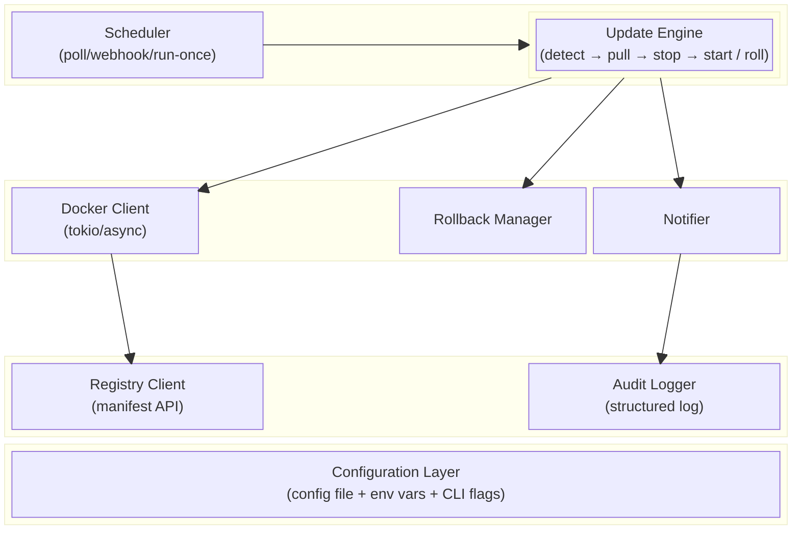

```mermaid
block
    columns 1
        
    block
        columns 4
        scheduler["Scheduler\n(poll/webhook/run-once)"] space
        block:update_engine
            columns 1
            update["Update Engine\n(detect → pull → stop → start / roll)"]
        end
    end
    space
    block 
        columns 4
        docker["Docker Client\n(tokio/async)"] space rollback["Rollback Manager"] notifier["Notifier"]
    end
    space
    block
        columns 3
        registry["Registry Client\n(manifest API)"] space audit["Audit Logger\n(structured log)"]
    end
    block
        config["Configuration Layer\n(config file + env vars + CLI flags)"]
    end

    scheduler-->update_engine
    update_engine-->docker
    update_engine-->rollback
    update_engine-->notifier
    docker-->registry
    notifier-->audit
```